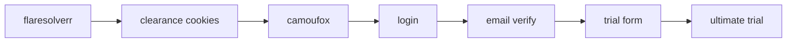
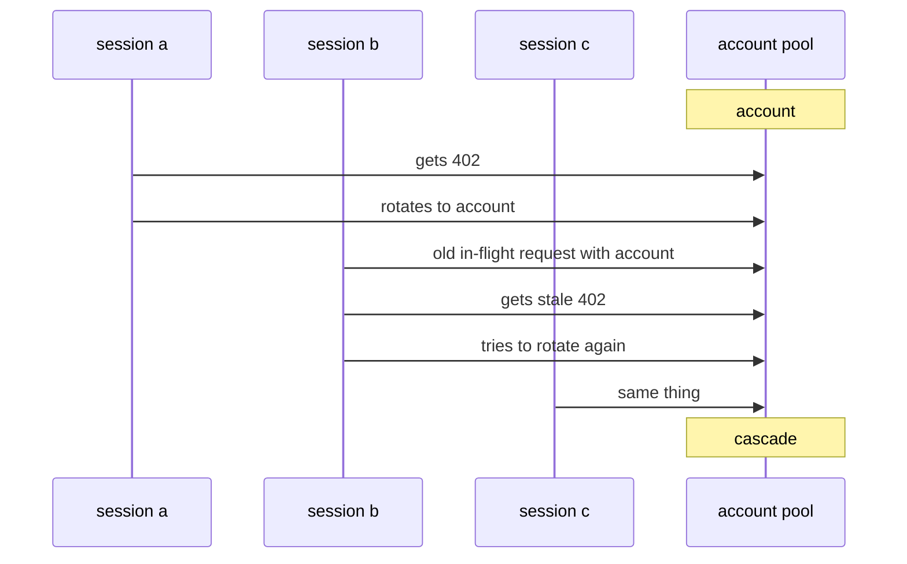
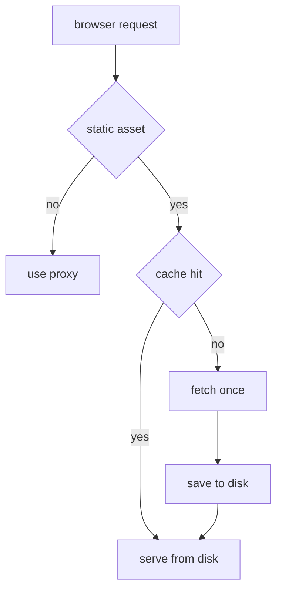
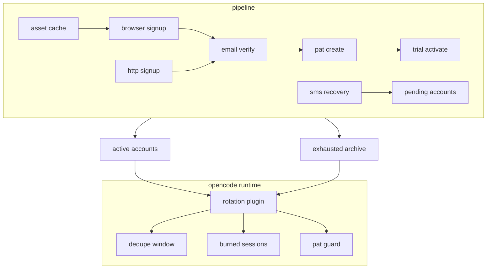

*standard disclaimer: this writeup is for educational security research purposes only. the techniques described involve interacting with public-facing web services in ways that may violate terms of service. i am not encouraging or providing operational tooling for abuse.*

## tl;dr

*gitlab duo* is gitlab's ai assistant, backed by *anthropic*'s models. gitlab gives new accounts a 30-day <Term tip="GitLab's time-limited premium trial tier that unlocks Ultimate features and Duo access.">ultimate trial</Term>. **the limit is per account, not per person, machine, or billing entity.** the end result was a pipeline that created accounts, verified them, created <Term tip="Account-scoped access tokens used to authenticate API and CLI requests without a password.">personal access tokens</Term>, activated trials, and rotated through a live pool.

over the life of the pipeline, it produced at least **87 fully trial-activated accounts**. separate from that, **943 non-email-only accounts** were preserved for later recovery instead of being thrown away.

## introduction

after google did a massive ban wave on users running their *antigravity* and *gemini cli* in third-party harnesses, in my case *opencode*, i lost the ability to access the midas touch, also known as *opus*, which, albeit limited, came included with their *antigravity* <Term tip="An authorization flow where an app gets scoped access to a provider account without asking for the user's password directly.">oauth</Term>.

so i started looking around. there had to be a way of getting *anthropic*'s models on ai coding harnesses that were not *claude code*.

*github copilot*? i already had a sub. but it was nowhere near enough. it only lasted me for a week. i would have had to buy four different accounts.

*kiro*? it did not look too bad. but they were not really transparent about how quickly credits got used per model. plus, the servers were so bad on my free tier that i could not even use *claude opus 4.5*; only *claude sonnet 4.5* and *claude haiku 4.5*.

so that was when i found the golden cow. gitlab offers a free trial for their ultimate tier, which also includes **$24 worth of credits** for *gitlab duo*, their ai platform, which equals 24 regular credits. for reference, each *opus* request consumes about 1.2 credits, so call it **about 20 requests per account**.

that was not bad at all, i thought. i might as well give it a try since it was free, while i searched for a proper replacement.

you should have seen how quickly that "replacement" plan disappeared from my mind once i noticed their lack of proper defenses against systematic automation. what do you mean i can just activate the trial in a few clicks? **no credit card, no phone verification, nothing.** surely this was just because my account was aged and warmed up.

it was not.

## target overview

*gitlab duo* provides:

- code suggestions in the ide
- chat-based code explanation and generation
- automated code review
- vulnerability explanation

for individual developers, the entry cost is zero. create a gitlab.com account, activate the ultimate trial, and you get access to duo until the trial or credits run out.

that is fine if you use it like a normal person.

i do not use it like a normal person. i run multiple ai-assisted development sessions in parallel. one account's credits disappear fast. the question was simple: could i automate that into an account-pool problem?


## phase 1: testing the waters

the first version was the obvious one: stay in http, stay light, and avoid browsers for as long as possible.

at first i thought the official auth flow might be the useful place to start, but it wasnt. the real job was creating a fresh gitlab account, verifying it, minting a pat, and activating a trial. almost all of that sat outside the documented happy path.

my first signup attempts used plain `requests`:

```python
import requests

session = requests.Session()
session.headers.update({
    "User-Agent": "Mozilla/5.0 (X11; Linux x86_64) AppleWebKit/537.36",
    "Accept": "text/html,application/xhtml+xml",
    "Accept-Language": "en-US,en;q=0.9",
})

response = session.get("https://gitlab.com/users/sign_up")
```

```python
response = session.post("https://gitlab.com/users", data=signup_data)
# 403 forbidden
```

headers were not the issue. the proxy was not the whole issue either. the issue was the <Term tip="The observable signature a client exposes during the TLS handshake, often used to distinguish browsers from automation.">tls fingerprint</Term> itself. standard python `requests` had the wrong fingerprint and <Term tip="A CDN and security platform that often sits in front of websites to rate-limit, inspect, and challenge suspicious traffic.">cloudflare</Term> treated it like exactly what it was: automation.

the first real improvement was switching the signup path to <Term tip="A Python HTTP client built on curl/libcurl that can impersonate real browser TLS and HTTP behavior."><code>curl_cffi</code></Term> with browser impersonation. that got the early pipeline past the tls wall often enough to be worth building on.

## phase 2: im not a robot


once the raw signup post could make it through, <Term tip="Arkose Labs FunCaptcha, an interactive anti-bot challenge used on signup and login flows.">arkose</Term> became the next problem.

gitlab's signup page embeds the arkose challenge parameters directly in the html:

```python
arkose_div = soup.select_one("#js-arkose-labs-challenge")
params = {
    "csrf_token": csrf_input["value"],
    "arkose_public_key": arkose_div.get("data-api-key", ""),
    "arkose_domain": arkose_div.get("data-domain", ""),
    "arkose_blob": str(arkose_div.get("data-data-exchange-payload", "")).strip(),
}
```

the first working captcha path used <Term tip="A paid captcha-solving service that supports challenge types such as FunCaptcha and reCAPTCHA.">anti-captcha</Term>. that was the primary solver on the legacy pipeline. <Term tip="A paid captcha-solving marketplace and API used to outsource captcha solves.">2captcha</Term> came after that as fallback, not as the original main path. the problem was that *anti-captcha* was never that reliable operationally. funcaptcha worker availability kept disappearing, `ERROR_NO_SLOT_AVAILABLE` would stall runs for long stretches, and even the picked-up tasks were not always solvable. that was not good at all.

the flow looked like this:

1. fetch signup page
2. extract <Term tip="A per-request anti-forgery token used to prevent forged form submissions.">csrf</Term> + arkose parameters
3. send the challenge to *anti-captcha*
4. fall back to *2captcha* when needed
5. inject the returned token into the signup form
6. post the registration through the impersonated http client

the early assumption was that solving the captcha was the hard part. in practice, it was only one part of the problem. the harder issue was getting stable throughput through *cloudflare* and bad proxy luck. across the big legacy runs, the http pipeline had roughly 5-8% yield from attempt to usable account.

the email side was equally scrappy. the first inbox path used <Term tip="A disposable email inbox provider.">gopretstudio</Term>, and i had to reverse-engineer its next.js server actions just to fetch mail reliably. once that path was understood, it worked fairly reliably, but it was still a dependency i did not control.

## phase 3: surely this part is more secure

account creation was only half the story. the real value was the ultimate trial.

trial activation was a browser problem from the start. the working path ended up using two tools:

- <Term tip="A proxy service that solves Cloudflare browser challenges and returns usable cookies or page state.">flaresolverr</Term> to get through *cloudflare* and harvest clearance cookies
- <Term tip="An anti-detection browser project built around Firefox.">camoufox</Term> to continue the session in a browser that looked real enough to survive the rest of the flow



the trial form itself was simple, but success was delayed. it wanted company details, country, and some dropdown selections. if i submitted the form and checked the <Term tip="An API endpoint used to read account or namespace state after a workflow step completes.">namespace api</Term> immediately, the account still looked free. a short wait and a second check showed the trial had landed. "submit form" was not success. "submit form, wait, verify through api" was success.

## phase 4: do a barrel roll

once one account could be trialed end to end, the next problem showed up right away: one account was nowhere near enough.

gitlab eventually returns `402 payment required` or one of several text variants when duo credits are gone. so i built an <Term tip="An AI coding harness and agent runtime for terminal-driven development workflows.">opencode</Term> plugin that listens for those failures, marks the current account dead, swaps in the next pat, and keeps the session moving.

```typescript
function isPermanentCreditExhaustion(message: string): boolean {
  const lower = message.toLowerCase()
  return (
    lower.includes("consumer does not have sufficient credits") ||
    lower.includes("insufficient credits for this request") ||
    lower.includes("402 payment required") ||
    lower.includes("duo chat is not available")
  )
}
```

the core mechanism was simple:

1. detect a real credit exhaustion
2. archive the current account
3. rotate auth to the next live account
4. continue without asking me to babysit it

at that point this stopped feeling like signup automation and started feeling like runtime infrastructure.

## phase 5: this was supposed to be the easy part

the first live rotations exposed a bug that completely broke it.

i was running multiple ai sessions at once. one session hit `402`, rotated correctly, and moved on. then other sessions that still had in-flight requests using the old pat started failing too. those stale failures looked like fresh exhaustion events, so they rotated again. within seconds, the pool started eating itself.



the fix ended up being a few separate safeguards:

- a 15-second deduplication window keyed on `(session_id, normalized_message)`
- a disk-persisted burned-session set shared across processes, although i later removed that part for my own personal use case
- a pat-match guard before blaming the currently active account
- a short grace period on freshly rotated accounts

once a session had already triggered a real rotation, future `402`s from that same session usually had to be ignored, especially if the replacement account was still inside the grace period.

## phase 6: fordism

after that, the project shifted from "can this work at all?" to "what happens when i try to do it at volume?"

the scale-up runs depended heavily on <Term tip="Proxy traffic routed through consumer ISP IP addresses rather than datacenter IP space.">residential proxies</Term> across rotating gateway ports. this was not a minor implementation detail, but it also was not the whole story. the real gate was gitlab's risk scoring, and proxy quality was just one of several inputs feeding it alongside timing, browser behavior, signup path, and whatever internal signals gitlab was weighting.

**“internal signals? what does that mean here?”** gitlab was combining things like ip reputation, browser behavior, request timing, and signup path into an internal score, then using that score to decide which verification bucket an account landed in.

my early mental model was too simple: solve captcha, verify email, done. in practice, gitlab split accounts into buckets:

- email-only
- email + phone
- phone-only
- phone + credit_card


that changed the whole pipeline: email-only accounts were the gold path. phone-gated accounts became the normal operational branch once scale entered the picture. credit-card-gated accounts were mostly a dead end.

on the bigger batch runs, most attempts did not land in the easy lane. depending on the overall risk score, the non-email-only rate got as high as roughly 92%. **scale made the pattern obvious: this was a scoring system, not one filter you could beat once and move on from.**

## phase 7: burner phones, but less cool


this is where <Term tip="An SMS verification provider that rents temporary phone numbers and exposes incoming one-time codes through an API.">smspva</Term> entered the pipeline. i only implemented it once scale-up runs showed non-email-only rates climbing as high as roughly 92%, which meant **phone verification was no longer some weird edge case. it was the standard outcome the system had to be ready for.** email-only stayed the best lane, but the operational assumption at scale had to be "this account will need sms."

nl numbers were the cheap primary choice and uk was fallback. at the same time, non-email-only accounts stopped getting thrown away. they were preserved in sqlite for later recovery instead of being lost between runs.


## phase 8: act broke to stay rich

once the browser path became more important, proxy bandwidth started to matter.

gitlab's browser flows pull a lot of heavy, mostly immutable js and css. paying residential proxy bandwidth to redownload the same webpack bundles every run was dumb, so i added a shared disk cache for browser assets.



proxy download traffic dropped by roughly 60-70% on the mature browser pipeline. that mattered because by this point the pipeline was doing repeated sign-in, verify, pat, and trial runs through a real browser.

## phase 9: fordism but fr this time

the next step was turning the scripts into an actual phased pipeline.

instead of a pile of one-off flows, the project grew a batch engine with persistent state:

- signup + verification phase
- pat phase
- trial phase
- pending-verification preservation
- active pool output
- exhausted archive output

that changed two important things.

first, exhausted accounts stopped cluttering the live rotation pool. once an account hit a real `402`, it was copied into the exhausted archive and removed from the active file.

second, partially useful accounts stopped getting lost. if an account made it through signup but landed behind extra verification, it could be saved for later recovery instead of vanishing into a failed batch log.

that state lived in `pending-verification.db`, which mattered because the phone/card-gated population was too large to treat as disposable noise. over the full life of the pipeline, that backlog grew to 943 preserved accounts. that is a cumulative number, not just a snapshot of the final high-reliability path.

## phase 10: pausing an online game

then the machine rebooted and a different class of bugs showed up.

the hard part here was no longer creating another account. it was getting back into the accounts that already existed and were now stranded somewhere between login and pat creation.

the stable pat path ended up with three important changes:

1. keep and reuse the hot authenticated session that already existed after verification
2. capture the `glpat-*` token from the post response before redirect discards it
3. try no-proxy first for pat creation, then fall back to proxy mode when needed

it looked backwards, but it worked. after reboot, proxy-mode sign-in often wasted time on fresh *cloudflare* friction or broken page state. going no-proxy first for pat creation recovered stuck accounts faster; proxy mode became the fallback, not the default.

this phase also exposed another unpleasant truth: gitlab purges accounts that do not complete the whole signup-to-pat flow quickly enough. that killed a bunch of earlier "create now, finish later" assumptions.

## phase 11: everything in its right place


the last big improvement came from cleaning up the two messiest dependencies in the whole project: email and signup submission.

on the email side, *gopretstudio* stopped being the main path. i moved to owned domains routed through <Term tip="An email hosting provider for custom domains.">purelymail</Term>, with catch-all forwarding into a central relay mailbox. that meant:

- no third-party disposable inbox dependency on the primary path
- stable imap polling
- full control over the accepted mailbox domains
- domains that looked less disposable, which helped keep risk scoring lower than the throwaway-inbox path

on the signup side, the primary path moved into `browser_signup.py`. that browser pipeline used *camoufox*, human-like input behavior, and a three-tier submit strategy:

1. normal click
2. refill and try again if the page glitched
3. direct `form.submit()` to bypass vue's `@submit.prevent`

that last part mattered more than it sounds. the vue form handler was one of the reasons the browser path could look correct and still fail to advance. calling `form.submit()` directly cut through it.

solver dependence also shifted rather than disappearing. *anti-captcha*, *2captcha*, and later sms verification were still part of the real pipeline; the browser path just meant the brittle http-only captcha loop was no longer carrying the whole system by itself.

this was also the phase where the path stopped feeling fragile. the custom-domain browser pipeline hit 7/7 full end-to-end success for email-only accounts at about 7 minutes per account.

## so... did it work?

there are really two outcome metrics in this story, and mixing them is what made the numbers sound contradictory.

the first is the first mature checkpoint: 17 fully trial-activated accounts, plus the 7/7 custom-domain browser run for the clean email-only lane at about 7 minutes per account.

the second is the lifetime total after the pipeline kept running: at least 87 fully trial-activated accounts overall.

separately, the system also preserved 943 non-email-only accounts for later recovery instead of throwing them away. that backlog matters, but it is not the same metric as "successfully activated."

so the clean way to read the numbers is:

| metric | what it represents | numbers |
|--------|--------------------|---------|
| first mature checkpoint | first stable proof that the pipeline worked end to end | `17` fully trial-activated accounts |
| custom-domain browser path | best mature path quality on the clean email-only lane | `7/7` email-only e2e, `~7 min/account` |
| lifetime activation total | total fully trial-activated accounts produced over the full run | `87+` fully trial-activated accounts |
| preserved recovery backlog | non-email-only accounts saved for later recovery | `943` cumulative pending accounts |

## final architecture

by the end, the project looked like this:



### rough cost per account

the relevant number for the final operational pipeline is not total project spend. it is the variable cost of one successful account on the mature browser path, with phone verification treated as a normal branch rather than a footnote.

the local notes for that path estimate about 0.5 GB of residential proxy traffic for the post-cache browser pipeline, and the mature custom-domain batch reached 7/7 successful email-only accounts. if that 0.5 GB estimate is spread across those 7 successful creations, that is about 0.071 GB per account, or roughly 71 MB each. that gives a reasonable proxy-bandwidth baseline for the mature path, but it is not the whole operational picture because later mature runs also showed phone-gated accounts and external captcha fallback still happening.

at a proxy rate of $3.75/GB, the rough picture looks like this:

| component | email-only fast lane | phone-standard operational lane |
|-----------|----------------------|-------------------------------|
| proxy bandwidth | ~$0.27/account | ~$0.27/account |
| captcha | usually $0, but about +$0.0015 when *2captcha* fallback fires | usually $0, but about +$0.0015 when *2captcha* fallback fires |
| sms | $0 | $0.10 for uk primary or $0.22 for nl fallback |
| direct variable cost | about **`$0.27/account`** on the cleanest path | about **`$0.37/account`** with uk sms or **`$0.49/account`** with nl sms, before fixed mailbox/domain overhead |

the important distinction is that the perfected pipeline had two different cost profiles: a very cheap email-only lane, and a broader scale-up lane where risk scoring often pushed accounts into phone verification.

without the ~60-70% asset-cache reduction, the proxy share would have been roughly 177-238 MB per account instead, or about $0.67-0.89 per created account at the same proxy rate.

### was it actually worth it?

so... was all of this actually worth it in the end?


one live usage snapshot looked like this:

#### usage summary

| model | messages | input tokens | output tokens |
|-------|---------:|-------------:|--------------:|
| gitlab/duo-chat-sonnet-4-6 | 509 | 45.7M | 160.0K |
| gitlab/duo-chat-opus-4-6 | 6,060 | 582.2M | 2.1M |

using *anthropic*'s published base API pricing for Claude Sonnet 4.6 at $3 per million input tokens and $15 per million output tokens, and Claude Opus 4.6 at $5 and $25, here's what those totals would cost at list price. *anthropic* also notes premium pricing can apply to some Opus 4.6 prompts over 200k tokens, so this is a base-rate estimate, not a guaranteed exact bill.

#### estimated anthropic api cost

| model | input cost | output cost | estimated total |
|-------|-----------:|------------:|----------------:|
| gitlab/duo-chat-sonnet-4-6 | $137.10 | $2.40 | `$139.50` |
| gitlab/duo-chat-opus-4-6 | $2,911.00 | $52.50 | `$2,963.50` |
| grand total |  |  | `$3,103.00` |

either way, **the order of magnitude is the point**: the operational overhead was tiny compared with the amount of model usage the pool ended up delivering.


## conclusion

no one clever bypass made this work. it only became real once the whole path from "new account" to usable *anthropic* credits stopped being fragile and started behaving like a pipeline.

the first versions were messy: low-yield http signup, paid captcha solves, disposable inboxes, and lots of proxy noise. the final versions were much cleaner. signup moved onto a real browser path with a *vue* bypass. email verification moved onto *purelymail* and owned domains. runtime rotation stopped collapsing under stale `402`s. pat recovery stopped depending on fragile login retries after reboot.

honestly, i spent more time making the pipeline than actually using it. what i mainly wanted to prove was that the whole thing was scalable and automatable; *opus* ended up being the secondary reward once that part worked. i could have kept pushing it, but there is not much point now. codex is already enough for most of my workload, GPT-5.4 is effectively unlimited on my side too, and after moving away from *opencode* i do not have much reason to port the whole setup across harnesses.


if gitlab wanted to break this chain at the point that mattered most, **the best choke point would be trial activation, not the early signup friction.** stronger identity checks there would do more than making the captcha a little more annoying.
