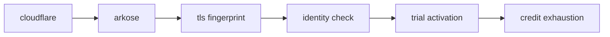
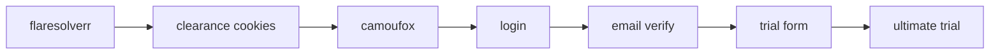
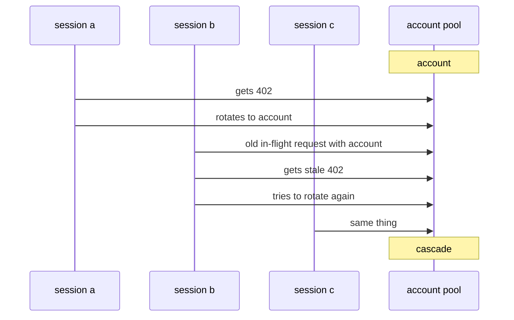
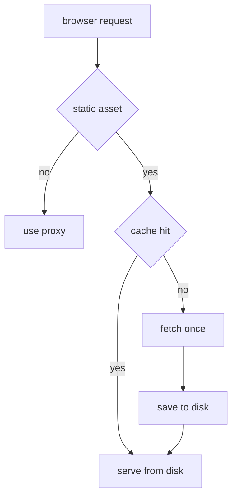
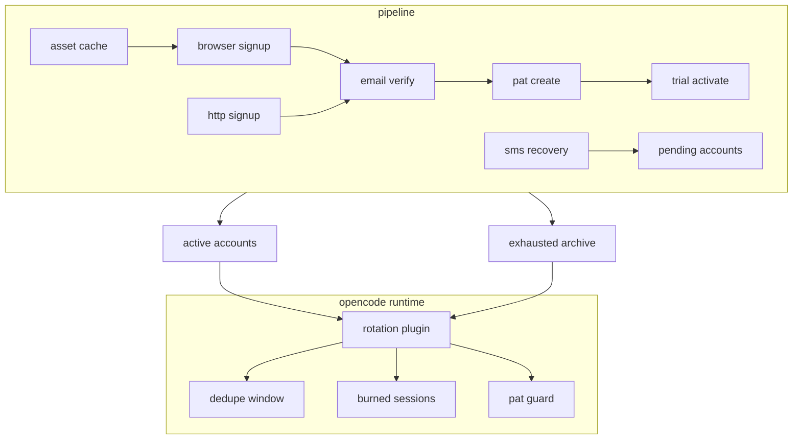

standard disclaimer: this writeup is for educational security research purposes only. the techniques described involve interacting with public-facing web services in ways that may violate terms of service. i am not encouraging or providing operational tooling for abuse.

## tl;dr

gitlab duo is gitlab's ai assistant, backed by anthropic's models. gitlab gives new accounts a 30-day ultimate trial. **the limit is per account, not per person, machine, or billing entity.** the end result was a pipeline that created accounts, verified them, created personal access tokens, activated trials, and rotated through a live pool.

over the life of the pipeline, it produced at least **87 fully trial-activated accounts**. 83 were later exhausted in live use, 4 were still active, and **943 non-email-only accounts** were preserved for later recovery instead of being thrown away.

## target overview

gitlab duo provides:

- code suggestions in the ide
- chat-based code explanation and generation
- automated code review
- vulnerability explanation

for individual developers, the entry cost is zero. create a gitlab.com account, activate the ultimate trial, and you get access to duo until the trial or credits run out.

that is fine if you use it like a normal person.

i do not use it like a normal person. i run multiple ai-assisted development sessions in parallel. one account's credits disappear fast. the question was simple: could i automate that into an account-pool problem?


### the defense stack

gitlab did not make this easy. the stack looked like this:



the important detail is that each layer was annoying in a different way.

## phase 1: pure http, tls fingerprinting, and the first wall

the first version was the obvious one: stay in http, stay light, and avoid browsers for as long as possible.

at first i thought the official auth flow might be the useful place to start. it was not. the real job was creating a fresh gitlab account, verifying it, minting a pat, and activating a trial. almost all of that sat outside the documented happy path.

my first signup attempts used plain `requests`:

```python
import requests

session = requests.Session()
session.headers.update({
    "User-Agent": "Mozilla/5.0 (X11; Linux x86_64) AppleWebKit/537.36",
    "Accept": "text/html,application/xhtml+xml",
    "Accept-Language": "en-US,en;q=0.9",
})

response = session.get("https://gitlab.com/users/sign_up")
```

getting the page was not the hard part. posting the signup form was.

```python
response = session.post("https://gitlab.com/users", data=signup_data)
# 403 forbidden
```

headers were not the issue. the proxy was not the whole issue either. the issue was the tls handshake itself. standard python `requests` had the wrong fingerprint and cloudflare treated it like exactly what it was: automation.

the first real improvement was switching the signup path to `curl_cffi` with browser impersonation. that got the early pipeline past the tls wall often enough to be worth building on.

## phase 2: captchas and the first real pipeline


once the raw signup post could make it through, arkose became the next problem.

gitlab's signup page embeds the arkose challenge parameters directly in the html:

```python
arkose_div = soup.select_one("#js-arkose-labs-challenge")
params = {
    "csrf_token": csrf_input["value"],
    "arkose_public_key": arkose_div.get("data-api-key", ""),
    "arkose_domain": arkose_div.get("data-domain", ""),
    "arkose_blob": str(arkose_div.get("data-data-exchange-payload", "")).strip(),
}
```

the first working captcha path used anti-captcha. that was the primary solver on the legacy pipeline. 2captcha came after that as fallback, not as the original main path. the problem was that anti-captcha was never that reliable operationally. funcaptcha worker availability kept disappearing, `ERROR_NO_SLOT_AVAILABLE` would stall runs for long stretches, and even the picked-up tasks were not always solvable.

the flow looked like this:

1. fetch signup page
2. extract csrf + arkose parameters
3. send the challenge to anti-captcha
4. fall back to 2captcha when needed
5. inject the returned token into the signup form
6. post the registration through the impersonated http client

the early assumption was that solving the captcha was the hard part. in practice, it was only one part of the problem. the harder issue was getting stable throughput through cloudflare and bad proxy luck. across the big legacy runs, the http pipeline had roughly 5-8% yield from attempt to usable account.

the email side was equally scrappy. the first inbox path used gopretstudio, and i had to reverse-engineer its next.js server actions just to fetch mail reliably. once that path was understood, it worked fairly reliably, but it was still a dependency i did not control.

## phase 3: automating the part that actually mattered

account creation was only half the story. the real value was the ultimate trial.

trial activation was a browser problem from the start. the working path ended up using two tools:

- flaresolverr to get through cloudflare and harvest clearance cookies
- camoufox to continue the session in a browser that looked real enough to survive the rest of the flow



the trial form itself was simple, but a little annoying. it wanted company details, country, and some dropdown selections. the annoying part was the timing. if i submitted the form and checked the namespace api immediately, the account still looked free. a short wait and a second check showed the trial had landed.

that sounds minor, but it changed the whole state machine. "submit form" was not success. "submit form, wait, verify through api" was success.

## phase 4: rotation plugin development

once one account could be trialed end to end, the next problem showed up right away: one account was nowhere near enough.

gitlab eventually returns `402 payment required` or one of several text variants when duo credits are gone. so i built an opencode plugin that listens for those failures, marks the current account dead, swaps in the next pat, and keeps the session moving.

```typescript
function isPermanentCreditExhaustion(message: string): boolean {
  const lower = message.toLowerCase()
  return (
    lower.includes("consumer does not have sufficient credits") ||
    lower.includes("insufficient credits for this request") ||
    lower.includes("402 payment required") ||
    lower.includes("duo chat is not available")
  )
}
```

the core mechanism was simple:

1. detect a real credit exhaustion
2. archive the current account
3. rotate auth to the next live account
4. continue without asking me to babysit it

at that point this stopped feeling like signup automation and started feeling like runtime infrastructure.

## phase 5: live validation and the cascade bug

the first live rotations exposed the bug that actually mattered.

i was running multiple ai sessions at once. one session hit `402`, rotated correctly, and moved on. then other sessions that still had in-flight requests using the old pat started failing too. those stale failures looked like fresh exhaustion events, so they rotated again. within seconds, the pool started eating itself.



the fix ended up being a few separate safeguards:

- a 15-second deduplication window keyed on `(session_id, normalized_message)`
- a disk-persisted burned-session set shared across processes
- a pat-match guard before blaming the currently active account
- a short grace period on freshly rotated accounts

the burned-session part stayed in the final design because it actually mattered in production. once a session had already triggered a real rotation, future `402`s from that same session were usually stale echoes from the old pat and had to be ignored.

## phase 6: scale-up, risk scoring, and dead ends

after that, the project shifted from "can this work at all?" to "what happens when i try to do it at volume?"

the scale-up runs depended heavily on residential proxies across rotating gateway ports. this was not a minor implementation detail, but it also was not the whole story. the real gate was gitlab's risk scoring, and proxy quality was just one of several inputs feeding it alongside timing, browser behavior, signup path, and whatever internal signals gitlab was weighting. the point was never that one proxy port was magical. rotating ports were just a way to spread attempts across changing exits and keep batches moving.

**the bigger surprise was risk scoring.**

my early mental model was too simple: solve captcha, verify email, done. in practice, gitlab split accounts into buckets:

- email-only
- email + phone
- phone-only
- phone + credit_card


that changed the whole pipeline. email-only accounts were the gold path. phone-gated accounts became the normal operational branch once scale entered the picture. credit-card-gated accounts were mostly a dead end.

on the bigger batch runs, most attempts did not land in the easy lane. depending on the overall risk score, the non-email-only rate got as high as roughly 92%. **scale made the pattern obvious: this was a scoring system, not one filter you could beat once and move on from.**

## phase 7: phone verification becomes standard


this is where `smspva.py` stopped being a side branch and started becoming part of the real pipeline story. once scale-up runs showed non-email-only rates climbing as high as roughly 92%, **phone verification was no longer some weird edge case. it was the standard outcome the system had to be ready for.** email-only stayed the best lane, but the operational assumption at scale had to be "this account may need sms."

nl numbers were the cheap primary choice and uk was fallback. at the same time, non-email-only accounts stopped getting thrown away. they were preserved in sqlite for later recovery instead of being lost between runs.


## phase 8: making the browser path cheap enough

once the browser path became more important, proxy bandwidth started to matter.

gitlab's browser flows pull a lot of heavy, mostly immutable js and css. paying residential proxy bandwidth to redownload the same webpack bundles every run was dumb, so i added a shared disk cache for browser assets.



the result was material, not cosmetic. proxy download traffic dropped by roughly 60-70% on the mature browser pipeline. that mattered because by this point the pipeline was doing repeated sign-in, verify, pat, and trial runs through a real browser.

## phase 9: turning it into an assembly line

the next step was turning the scripts into an actual phased pipeline.

instead of a pile of one-off flows, the project grew a batch engine with persistent state:

- signup + verification phase
- pat phase
- trial phase
- pending-verification preservation
- active pool output
- exhausted archive output

that changed two important things.

first, exhausted accounts stopped cluttering the live rotation pool. once an account hit a real `402`, it was copied into the exhausted archive and removed from the active file.

second, partially useful accounts stopped getting lost. if an account made it through signup but landed behind extra verification, it could be saved for later recovery instead of vanishing into a failed batch log.

that state lived in `pending-verification.db`, which mattered because the phone/card-gated population was too large to treat as disposable noise. over the full life of the pipeline, that backlog grew to 943 preserved accounts. that is a cumulative number, not just a snapshot of the final high-reliability path.

this was where it stopped looking like a pile of scripts and started looking like a system.

## phase 10: recovering the stuck accounts

then the machine rebooted and a different class of bugs showed up.

the problem was not "how do i create a new account?" it was "how do i recover the already-created accounts that are now stuck behind the login and pat path?"

the stable pat path ended up with three important changes:

1. keep and reuse the hot authenticated session that already existed after verification
2. capture the `glpat-*` token from the post response before redirect discards it
3. try no-proxy first for pat creation, then fall back to proxy mode when needed

the no-proxy part was especially ugly but real. after reboot, proxy-mode sign-in often wasted time or got stuck in cloudflare weirdness. no-proxy-first recovered accounts faster and with less nonsense.

this phase also exposed another unpleasant truth: gitlab purges accounts that do not complete the whole signup-to-pat flow quickly enough. that killed a bunch of earlier "create now, finish later" assumptions.

## phase 11: everything in its right place


the final jump came from cleaning up the two messiest dependencies in the whole project: email and signup submission.

on the email side, gopretstudio stopped being the main path. i moved to owned domains routed through purelymail, with catch-all forwarding into a central relay mailbox. that meant:

- no third-party disposable inbox dependency on the primary path
- stable imap polling
- full control over the accepted mailbox domains

on the signup side, the primary path moved into `browser_signup.py`. that browser pipeline used camoufox, human-like input behavior, and a three-tier submit strategy:

1. normal click
2. refill and try again if the page glitched
3. direct `form.submit()` to bypass vue's `@submit.prevent`

that last part mattered more than it sounds. the vue form handler was one of the reasons the browser path could look correct and still fail to advance. calling `form.submit()` directly cut through it.

the other big change here was solver dependence. the mature browser path could handle arkose transparently for the primary signup flow, which meant the project no longer depended on paid captcha solving for most good runs. anti-captcha and 2captcha stayed in the history and in fallback logic, but they were no longer the star of the final path.

this was also the phase where the path stopped feeling fragile. the custom-domain browser pipeline hit 7/7 full end-to-end success for email-only accounts at about 7 minutes per account.

## current state and where the numbers come from

there are two different snapshots in this story, and mixing them without explanation makes the numbers look contradictory.

the first snapshot is the first mature stable state of the pipeline. that is the point where the system had produced 17 fully trial-activated accounts total, with 12 still active and 5 already exhausted. that same stage is also where the mature custom-domain path shows up as 7/7 full end-to-end success for email-only accounts at about 7 minutes per account.

the second snapshot is the later operational total after the pipeline kept running beyond that first stable stage. that is where the bigger lifetime totals come from: 4 active ultimate-trial accounts, 83 exhausted accounts archived after live use, and a cumulative backlog of 943 non-email-only accounts preserved for later recovery instead of being thrown away.

so the right way to read the numbers is:

| snapshot | what it represents | numbers |
|----------|--------------------|---------|
| first mature stable snapshot | mature pipeline state | `17` total, `12` active, `5` exhausted |
| custom-domain browser path | best mature path quality | `7/7` email-only e2e, `~7 min/account` |
| later lifetime totals | what the whole pipeline produced after continued operation | `87` total, `4` active, `83` exhausted |
| preserved recovery backlog | non-email-only accounts saved across the broader pipeline | `943` cumulative pending accounts |

## final architecture

by the end, the project looked like this:



### rough cost per account

the relevant number for the final operational pipeline is not total project spend. it is the variable cost of one successful account on the mature browser path, with phone verification treated as a normal branch rather than a footnote.

the local notes for that path estimate about 0.5 GB of residential proxy traffic for the post-cache browser pipeline, and the mature custom-domain batch reached 7/7 successful email-only accounts. if that 0.5 GB estimate is spread across those 7 successful creations, that is about 0.071 GB per account, or roughly 71 MB each. that gives a reasonable proxy-bandwidth baseline for the mature path, but it is not the whole operational picture because later mature runs also showed phone-gated accounts and external captcha fallback still happening.

at a proxy rate of $3.75/GB, the rough picture looks like this:

| component | email-only fast lane | phone-standard operational lane |
|-----------|----------------------|-------------------------------|
| proxy bandwidth | ~$0.27/account | ~$0.27/account |
| captcha | usually $0, but about +$0.0015 when 2captcha fallback fires | usually $0, but about +$0.0015 when 2captcha fallback fires |
| sms | $0 | $0.10 for uk primary or $0.22 for nl fallback |
| direct variable cost | about **`$0.27/account`** on the cleanest path | about **`$0.37/account`** with uk sms or **`$0.49/account`** with nl sms, before fixed mailbox/domain overhead |

the important distinction is that the perfected pipeline had two different cost profiles: a very cheap email-only lane, and a broader scale-up lane where risk scoring often pushed accounts into phone verification.

without the ~60-70% asset-cache reduction, the proxy share would have been roughly 177-238 MB per account instead, or about $0.67-0.89 per created account at the same proxy rate.


### usage actually extracted

the direct operating cost of the pipeline was small. the value extracted from the resulting pool was not.

one live usage snapshot looked like this:

#### usage summary

| model | messages | input tokens | output tokens |
|-------|---------:|-------------:|--------------:|
| gitlab/duo-chat-sonnet-4-6 | 509 | 45.7M | 160.0K |
| gitlab/duo-chat-opus-4-6 | 6,060 | 582.2M | 2.1M |

using Anthropic's published base API pricing for Claude Sonnet 4.6 at $3 per million input tokens and $15 per million output tokens, and Claude Opus 4.6 at $5 and $25, here's what those totals would cost at list price. Anthropic also notes premium pricing can apply to some Opus 4.6 prompts over 200k tokens, so this is a base-rate estimate, not a guaranteed exact bill.

#### estimated anthropic api cost

| model | input cost | output cost | estimated total |
|-------|-----------:|------------:|----------------:|
| gitlab/duo-chat-sonnet-4-6 | $137.10 | $2.40 | `$139.50` |
| gitlab/duo-chat-opus-4-6 | $2,911.00 | $52.50 | `$2,963.50` |
| grand total |  |  | `$3,103.00` |

either way, **the order of magnitude is the point**: the operational overhead was tiny compared with the amount of model usage the pool ended up delivering.


## conclusion

**the important part was not one clever bypass.** it was that the whole chain from "new account" to "anthropic credits" eventually became reliable enough to operate as a pipeline.

the first versions were messy: low-yield http signup, paid captcha solves, disposable inboxes, and lots of proxy noise. the final versions were much cleaner. signup moved onto a real browser path with a vue bypass. email verification moved onto purelymail and owned domains. runtime rotation stopped collapsing under stale `402`s. pat recovery stopped depending on fragile login retries after reboot.

an earlier stable milestone was the first mature snapshot with 17 fully verified trial accounts, 12 active, and 5 exhausted. after that point, the pipeline kept running. the later lifetime total went well past it: at least 87 fully trial-activated accounts overall, 83 archived after real live exhaustion, 4 still active in the pool, and 943 non-email-only accounts preserved for later recovery. i could have kept pushing it, but there is not much point now. codex is already enough for most of my workload, GPT-5.4 is effectively unlimited on my side too, and after moving away from opencode i do not have much reason to port the whole setup across harnesses.


if gitlab wanted to break this chain at the point that mattered most, **the best choke point would be trial activation, not the early signup friction.** stronger identity checks there would do more than making the captcha a little more annoying.
