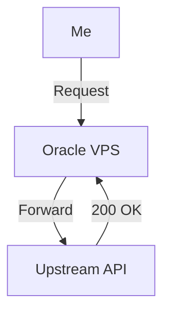
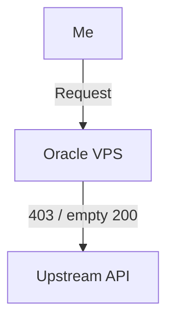
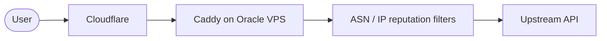
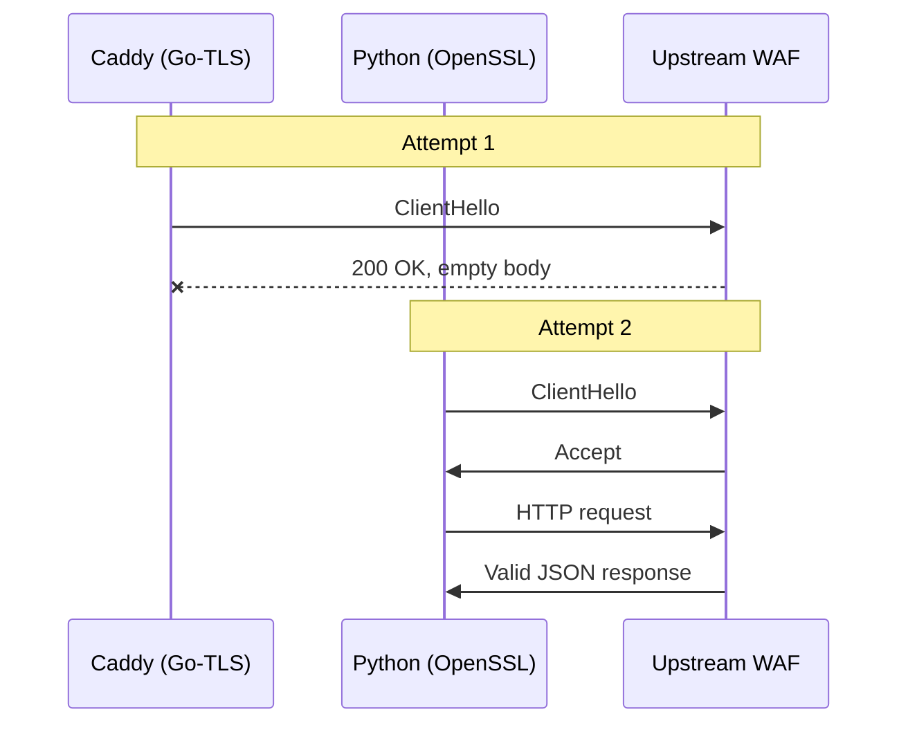
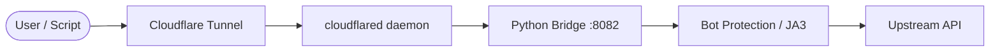
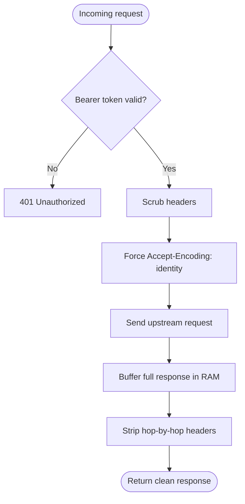

I wanted to reach an upstream AI API from any device through a single allowlisted VPS IP. What looked like a basic reverse-proxy task turned into a fight with cloud IP reputation, WAF header heuristics, JA3 TLS fingerprinting, IPv6 weirdness, and chunking failures.

## TL;DR

The "enterprise" proxy stack failed because the upstream was checking more than headers. It was fingerprinting the TLS handshake too. What finally worked was a much simpler Python bridge that looked like a normal OpenSSL client instead of a Go server.

## Objective

The goal was to use an Oracle Cloud VPS as a bridge:

1. client sends a request to the VPS
2. VPS forwards that request to the upstream API
3. upstream only sees the static VPS path, not a changing home or mobile IP

What I expected:



What actually happened:



## Phase 1: Infrastructure problems

The first pass used Caddy on an Oracle ARM box. That immediately turned into a deployment tax:

- package repos were unreliable for the target architecture
- binaries had to be pulled manually
- `systemd`, Oracle security lists, host firewall rules, and SELinux all got involved

Instead of exposing port 443 directly, the setup moved behind a Cloudflare Tunnel so the server only made outbound connections.



That solved the port-exposure problem, but it did not make the upstream trust the traffic.

## Phase 2: Dirty IP reputation

Oracle cloud ranges are treated as dirty by a lot of commercial threat intelligence feeds. The first obvious failure mode was direct `403 Forbidden`.

Cloudflare hid the Oracle source IP from the upstream edge, which helped, but it did not solve everything. The upstream still refused the traffic.

## Phase 3: Header scrubbing

The next thing I looked at was metadata leakage from the client stack.

Headers like these immediately expose automation:

- `python-requests/...`
- `node-fetch`
- `x-stainless-lang`

So the proxy was configured to scrub metadata and send a normal-looking browser or curl-style user-agent instead.

```nginx
header_up User-Agent "Mozilla/5.0 (Windows NT 10.0; Win64; x64)..."
header_up -x-stainless-*
header_up -X-Forwarded-For
```

That changed the response from an explicit block to something stranger:

`HTTP 200 OK`

with an empty body.

## The actual problem: JA3 fingerprinting

That "empty success" turned out to be a fingerprinting problem.

The upstream was not just checking the HTTP layer. It was checking the TLS `ClientHello` fingerprint:

- Chrome has one pattern
- Python with OpenSSL has another
- Caddy with Go’s `crypto/tls` has a distinct “I am a Go program” signature

If the HTTP headers claimed “Chrome” or “curl” but the handshake looked like Go, the upstream silently ghosted the request.



At that point I stopped using Caddy for the upstream hop.

## The working architecture

What I ended up with was a two-part bridge:

1. Cloudflare handled ingress
2. a local Python service handled egress
3. Python used OpenSSL through `requests`, which matched the expected fingerprint much better



## The bridge

The bridge was small, ugly, and it worked.

```python
from flask import Flask, request, Response
import requests
import os

app = Flask(__name__)

UPSTREAM_URL = "https://api.helfrio.com"
REAL_KEY = os.environ.get("UPSTREAM_API_KEY")
MY_PASSWORD = "MY_SECRET_GATEWAY_PASSWORD"

@app.route('/<path:path>', methods=["GET", "POST", "PUT", "DELETE"])
def proxy(path):
    client_auth = request.headers.get("Authorization", "")
    if MY_PASSWORD not in client_auth:
        return Response("unauthorized", 401)

    url = f"{UPSTREAM_URL}/{path}"
    headers = {
        "Authorization": f"Bearer {REAL_KEY}",
        "User-Agent": "curl/7.29.0",
        "Accept": "*/*",
        "Accept-Encoding": "identity",
        "Connection": "close",
    }

    if request.content_type:
        headers["Content-Type"] = request.content_type

    try:
        resp = requests.request(
            method=request.method,
            url=url,
            headers=headers,
            data=request.get_data(),
            timeout=30,
            stream=False,
        )

        excluded_headers = [
            "content-encoding",
            "content-length",
            "transfer-encoding",
            "connection",
        ]
        resp_headers = [
            (k, v) for (k, v) in resp.headers.items()
            if k.lower() not in excluded_headers
        ]

        return Response(resp.content, resp.status_code, resp_headers)
    except Exception as e:
        return Response(str(e), 500)

if __name__ == "__main__":
    app.run(host="0.0.0.0", port=8082)
```

## Reliability fixes

Even after switching the TLS fingerprint, the bridge still hit failures from transport behavior:

1. IPv6 routing from the Oracle environment was unreliable for the upstream path
2. chunked and compressed responses created bad interactions with the tunnel path

What finally stopped the breakage was:

- force IPv4
- force `Accept-Encoding: identity`
- disable streaming and fully buffer responses before returning them



## Security properties

It is a hack, but it holds up reasonably well:

- no public ingress ports on the VPS
- traffic enters through an outbound-authenticated tunnel only
- the Python bridge enforces its own bearer-style password gate
- the real upstream key stays on the server, not in client traffic
- Cloudflare edge filtering can cut noise before it reaches the tunnel

```python
if MY_PASSWORD not in client_auth:
    return Response("unauthorized", 401)
```

## Troubleshooting

### 1. `200 OK` with an Empty Body

- cause: TLS fingerprint mismatch
- fix: stop using the Go-based upstream hop and switch to Python/OpenSSL

### 2. `502 Bad Gateway`

- cause: IPv6 path instability or chunking mismatches
- fix: disable IPv6, disable streaming, return fully buffered responses

### 3. `403 Forbidden`

- cause: leaked automation headers or dirty source identity
- fix: scrub headers aggressively and keep the final request path boring

## Maintenance

```bash
sudo journalctl -u helfrio-bridge -f
sudo systemctl restart helfrio-bridge
sudo systemctl status cloudflared
sudo netstat -tulpn | grep python
```

## Conclusion

The whole thing ended up being about identity, not proxying.

The upstream did not care that requests were authenticated and syntactically correct. It cared whether the network behavior matched the story told by the headers. The winning stack was the boring one: make the last hop look ordinary.
